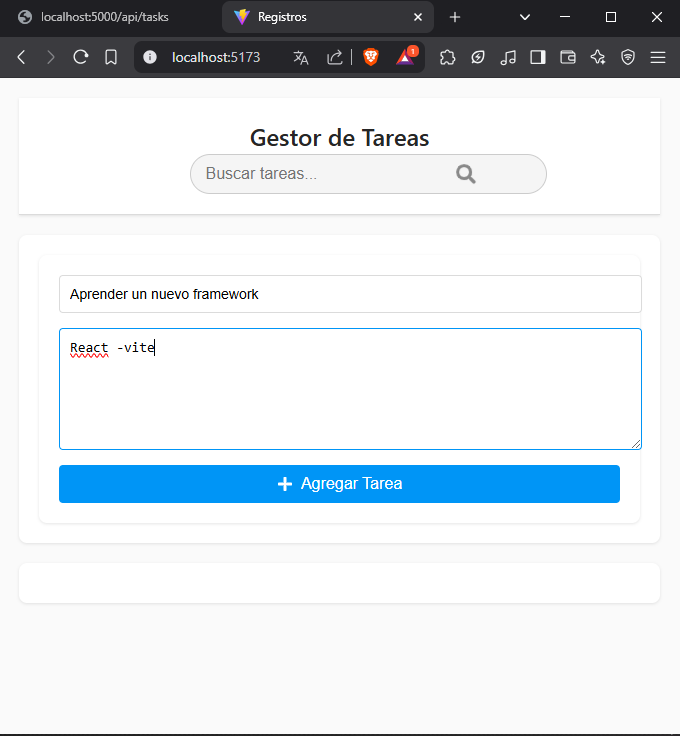
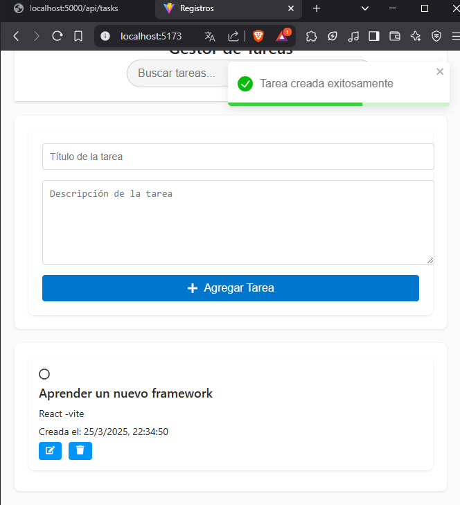
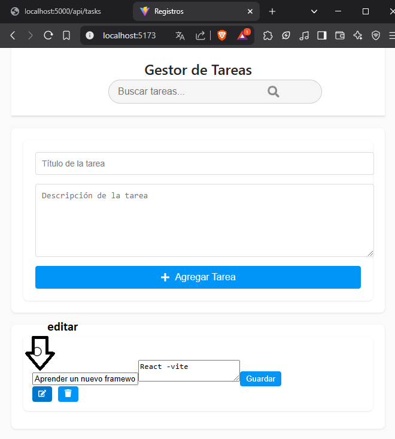
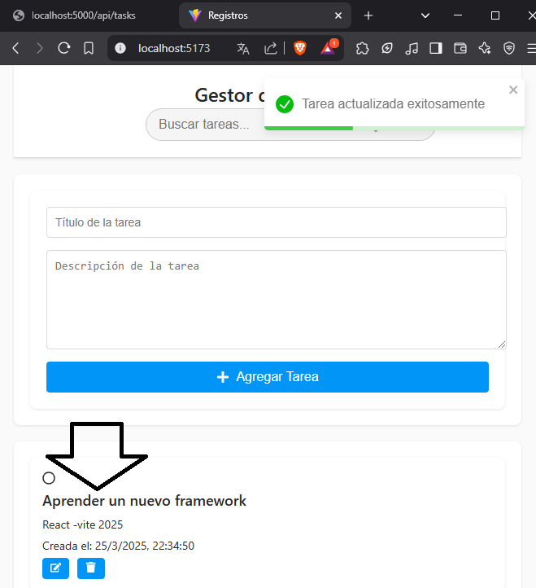
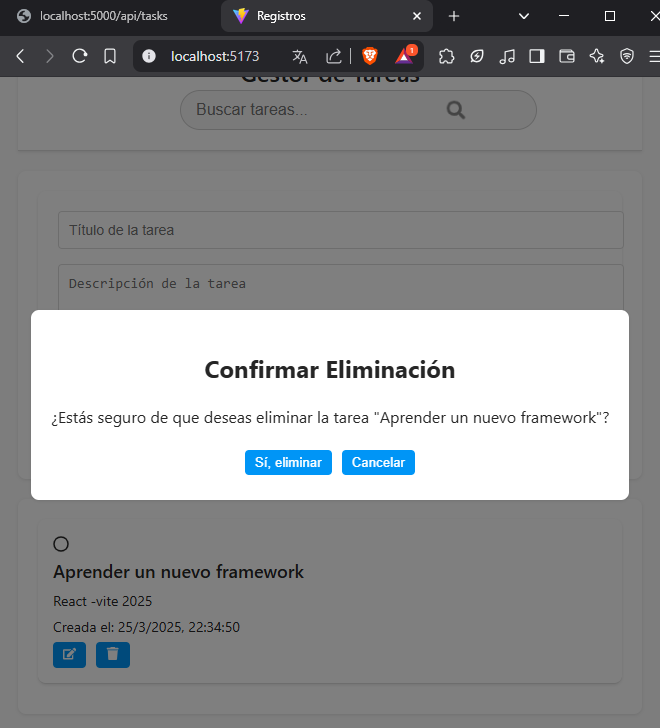
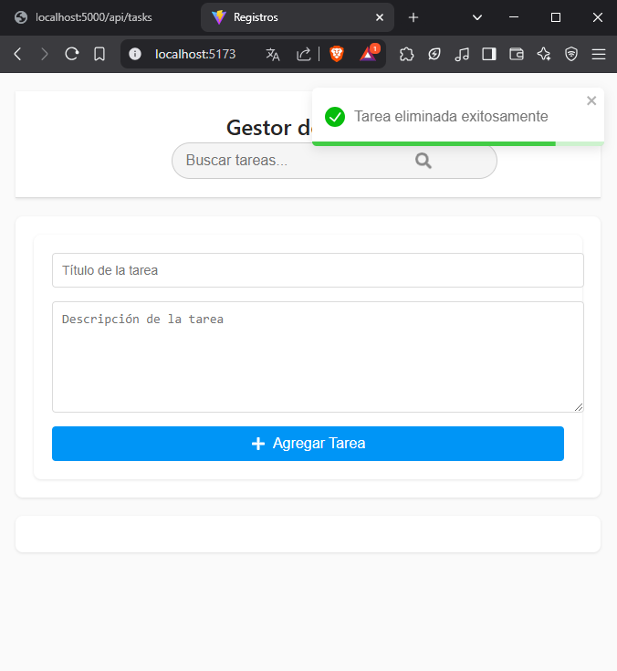

# Test_fortit_webv2
Para el backend 
npn install express cors
npm install

## Para el Fontend
 
 para crear e l proyecto nuevamente . 
 create vite@latest
    Selecionar react y TypeScript
npm install react-toastify
npm install react-icons
para correr -


npm install  
## FUNCIONAMIENTO 
 


## VIDEO DE FUNCIONAMIENTO 
 
## CAPTURAS DEL PROGRAMA 

## CAPTURAS DEL PROGRAMA 

## CAPTURAS DEL PROGRAMA 

## CAPTURAS DEL PROGRAMA 

## CAPTURAS DEL PROGRAMA 

## CAPTURAS DEL PROGRAMA 

## CAPTURAS DEL PROGRAMA 

## CAPTURAS DEL PROGRAMA 


### Recursos Adicionales

- **GitHub Pages**: Considera usar GitHub Pages para alojar tu documentación si deseas que sea accesible en línea.
  
- **Storybook**: Si tu proyecto incluye componentes de UI, Storybook es una excelente herramienta para documentar y mostrar componentes de manera interactiva.

Si necesitas más detalles sobre alguna de estas herramientas o secciones, ¡pregunta sin dudar! ### Mejores Prácticas para Documentación

- **Consistencia**: Mantén un estilo y formato consistente a lo largo de tu README. Esto incluye el uso de encabezados, listas y formato de texto.

- **Actualización Regular**: Asegúrate de actualizar la documentación cada vez que realices cambios significativos en el proyecto. Esto ayudará a los usuarios y colaboradores a mantenerse informados.

- **Ejemplos Claros**: Proporciona ejemplos claros y concisos que demuestren cómo utilizar las características principales de tu proyecto. Esto puede incluir fragmentos de código y escenarios de uso.

- **FAQ**: Considera agregar una sección de preguntas frecuentes (FAQ) para abordar dudas comunes que puedan tener los usuarios.

### Herramientas Adicionales

- **Notion**: Una herramienta versátil que permite crear documentación rica y colaborativa. Puedes usarla para organizar la documentación de tu proyecto y compartirla fácilmente.

- **MkDocs**: Si deseas crear una documentación más extensa y estructurada, MkDocs es una herramienta que te permite generar sitios web de documentación a partir de archivos Markdown.

- **Read the Docs**: Esta plataforma permite alojar y construir documentación de proyectos de código abierto. Es ideal si tu proyecto tiene una base de usuarios amplia.

### Ejemplo de Sección de FAQ

```markdown
## Preguntas Frecuentes

### ¿Cómo puedo contribuir al proyecto?
Para contribuir, por favor revisa la sección de contribuciones y sigue las pautas establecidas.

### ¿Qué versiones de Node.js son compatibles?
Este proyecto es compatible con Node.js versión 14 y superior.
